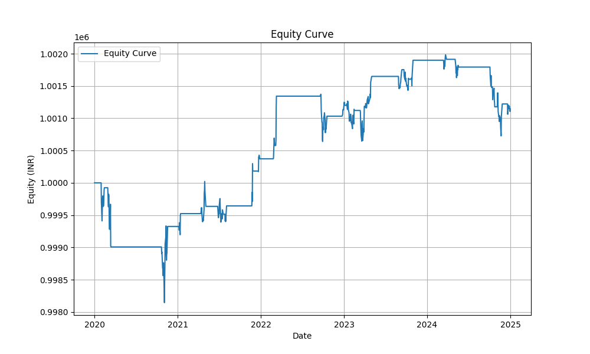
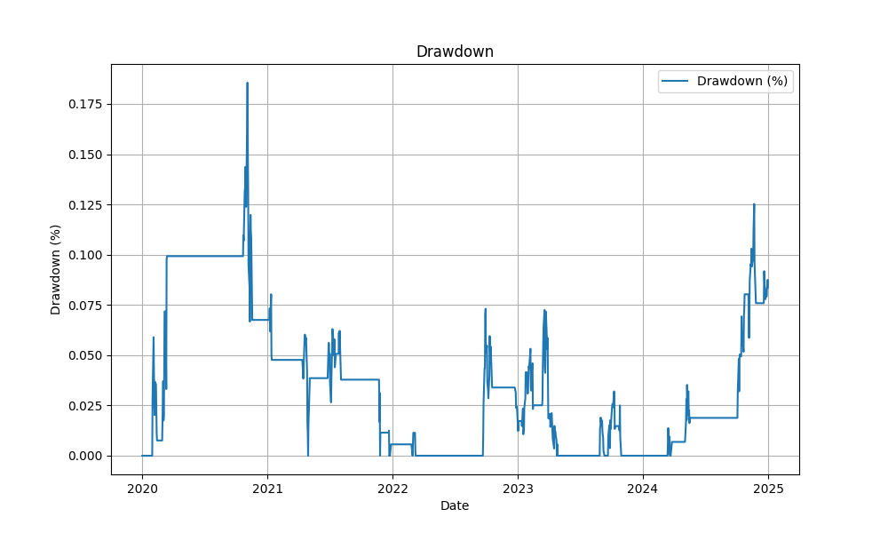

# 📈 Mean Reversion Trading Strategy using Bollinger Bands (RELIANCE.NS)

This project implements a rule-based quantitative trading strategy using **Bollinger Bands** to identify mean reversion opportunities in Indian equities, specifically on **RELIANCE.NS**. The strategy is benchmarked against **Nifty 50** and backtested over 5 years of daily data using Python.

---

## 🧠 Strategy Overview

- **Core Concept**: Mean reversion — assumes prices revert to a statistical average after extremes.
- **Indicators Used**:
  - 20-day Simple Moving Average (SMA)
  - ±2 standard deviation Bollinger Bands
  - Volatility filter (skips trades in bottom 25% volatility)
- **Execution Logic**:
  - Buy when price drops below the lower Bollinger Band.
  - Sell when price rises above the upper band or nears the SMA.
- **Risk Controls**:
  - 3% Stop-Loss
  - 1% capital allocation per trade

---

## ⚙️ Tools and Libraries Used

- `yfinance` – Historical OHLCV data
- `backtesting.py` – Backtest engine
- `pandas`, `numpy` – Data manipulation
- `matplotlib` – Visualization

---

## 🧪 Backtest Configuration

| Parameter        | Value                  |
|------------------|------------------------|
| Symbol           | RELIANCE.NS            |
| Benchmark Index  | Nifty 50 (`^NSEI`)     |
| Capital          | ₹1,000,000             |
| Commission       | 0.1% per trade         |
| Period           | Jan 1, 2020 – Jan 1, 2025 |
| Orders           | Exclusive (1 trade max) |
| Timeframe        | Daily (EOD trades)     |

---

## 📊 Performance Metrics

| Metric                          | Value   |
|---------------------------------|---------|
| **Cumulative Return (%)**       | 11.44   |
| **Annualized Return (%)**       | 2.32    |
| **Sharpe Ratio**                | 0.22    |
| **Sortino Ratio**               | 0.33    |
| **Max Drawdown (%)**            | 18.55   |
| **Win Rate (%)**                | 54.55   |
| **Profit Factor**               | 1.44    |
| **Average Profit (INR)**        | 336.49  |
| **Average Loss (INR)**          | 300.54  |
| **Max Profit (INR)**            | 989.92  |
| **Max Loss (INR)**              | 622.48  |
| **Nifty Cumulative Return (%)** | 94.09   |
| **Nifty Annualized Return (%)** | 14.46   |

📄 See full export: [`metrics_table.csv`](./metrics_table.csv)

---

## 📈 Visual Results

### 🟦 1. Equity Curve
Tracks capital over time during the backtest.

---

### 🔻 2. Drawdown Curve
Visualizes the percentage of peak-to-trough declines.

---

### 🟠 3. Price Chart with Trades
Shows buy/sell signals plotted on Bollinger Bands.

---

## 📂 Project Structure

mean-reversion-strategy/
|├── strategy.py # Full implementation (code)|
├── metrics_table.csv # Tabular summary of metrics
├── equity_curve.png # Portfolio value over time
├── drawdown.png # Drawdown percentage over time
├── price_with_trades.png # Trade entries/exits with indicators
├── README.md # This file

---

## 🔍 Insights & Observations

- The strategy generated profits and had a win rate over 50%.
- However, returns were modest and significantly **underperformed Nifty 50**.
- **Risk-adjusted performance (Sharpe/Sortino)** is low — suggesting limited reward for the risk taken.
- Suitable mostly in **sideways or mean-reverting markets**, but weak in trending phases.

---

## 🚀 Future Enhancements

To improve profitability and robustness:

- Add **market regime filters** (avoid trending phases).
- Use **dynamic stop-loss/take-profit** based on volatility.
- Expand to a **portfolio of mean-reverting Indian stocks**.
- Combine with other indicators (e.g., RSI, MACD) for signal confirmation.

---

## ✅ Summary

This project demonstrates:

- Full pipeline: Strategy → Backtest → Evaluation → Visualization
- A working foundation for beginner-friendly mean reversion systems
- Scope for improvement with advanced signal processing and filtering

---

> 📌 Made for educational & research purposes using Indian market data from Yahoo Finance. Always test your strategy on real-world data before live deployment.
